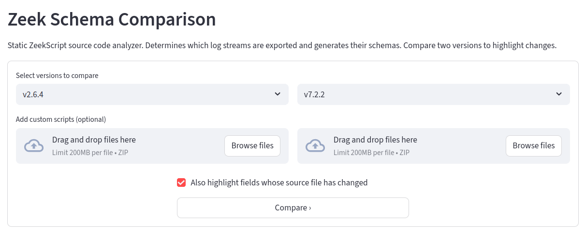
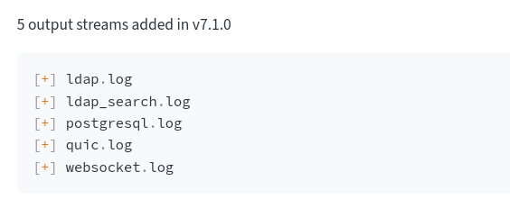
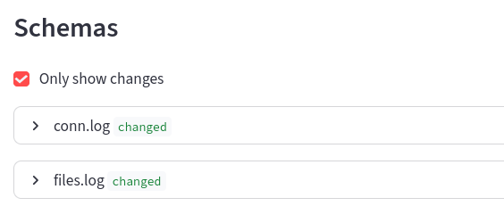
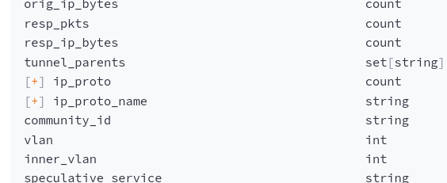

# Zeek Log Schema

Static ZeekScript source code analyzer that generates schemas for log streams. Streamlit app included to compare Zeek versions and highlight the differences.

## Usage

### Streamlit app

Clone this repository and run the Streamlit app with `uv` from the repository root.

```shell
cd /path/to/zeek-log-schema
uv run -- streamlit run app/app.py
```

The app should open automatically. If not, try http://localhost:8501 or follow the instructions in the `streamlit` command output.

Select two Zeek versions to compare and optionally provide other `.bro` or `.zeek` files to analyze, for example, custom plugins. Hit `Compare >` and wait for the analyzer to finish, which can take up
to 30 seconds.



The app will now display the schema for each log stream, or only show changed schemas. 

<table><tr>
    <td width="33.33%">
        <br>
        <b>Output stream (log file) updates</b>
    </td>
    <td width="33.33%">
        <br>
        <b>Select output stream to show diff</b>
    </td>
    <td width="33.33%">
        <br>
        <b>Field updates highlighted</b>
    </td>
</tr></table>

### Library

Minimal example:

```python
from pathlib import Path

from zeek_log_schema.zeek import process_zeek_source

# Path to Zeek source code to analyze, for example:
# $ git clone https://github.com/zeek/zeek.git /tmp/zeek
base_path = Path('/tmp/zeek/')

# Analyze ZeekScript files
result = process_zeek_source(base_path.glob('**/*.zeek'))

# Alternatively, look for both .bro and .zeek files:
# from itertools import chain
# result = process_zeek_source(
#     chain(base_path.glob('**/*.bro'), base_path.glob('**/*.zeek'))
# )

print(result)
```

## Development

First time setup:

```shell
uv venv
```

To hot reload Python module code from `zeek_log_schema` in Streamlit, start the app with `PYTHONPATH=.` from the repository root.

```shell
PYTHONPATH=. uv run -- streamlit run app/app.py
```
